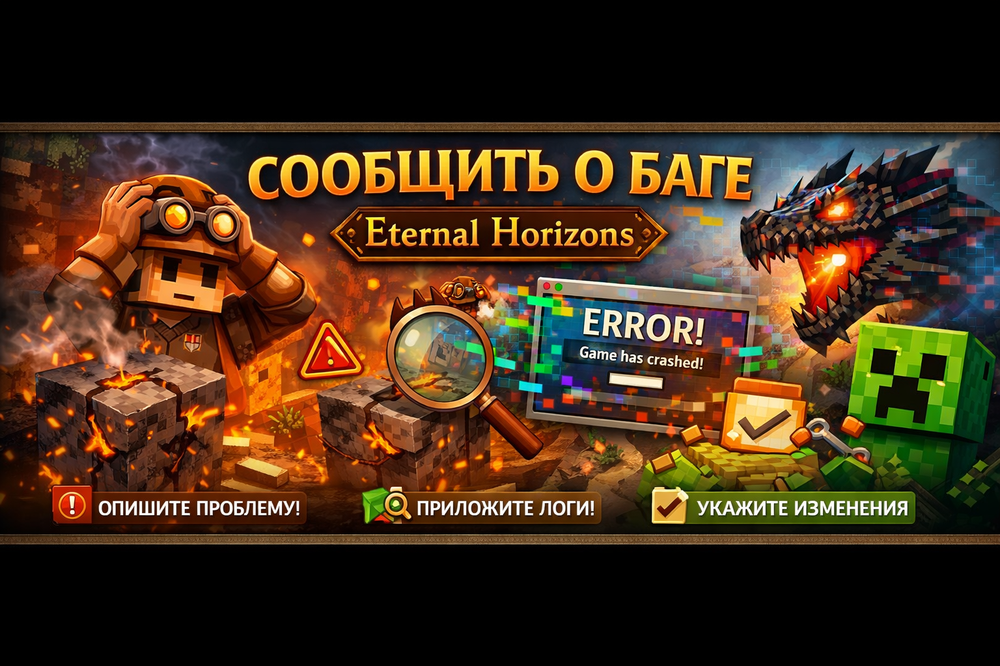

  

# 🐞 Сообщить о баге  
### Eternal Horizons

Спасибо, что помогаете улучшать сборку ❤️  
Пожалуйста, заполните форму ниже как можно подробнее — это сильно ускорит исправление.

---

## 📌 Основная информация

- **Версия сборки:**  
- **Версия Minecraft:** 1.20.1  
- **Forge версия:**  
- **Операционная система:** (Windows / Linux / macOS)

---

## 🧩 Описание проблемы

**Что произошло?**  
(Опишите проблему максимально подробно)

---

## 🔁 Шаги для воспроизведения

1.  
2.  
3.  

---

## 📎 Логи и отчёты

❗ **Обязательно приложите файлы:**
- `latest.log`
- `crash-report` (если есть)

Подсказка:
- Логи можно загрузить на Pastebin / GitHub Gist / Google Drive и прикрепить ссылку.

---

## ⚙️ Изменения в сборке

Отметьте, если применимо:

- [ ] Добавлял свои моды  
- [ ] Удалял моды  
- [ ] Менял шейдеры  
- [ ] Менял текстурпаки  
- [ ] Менял настройки  
- [ ] Использую чистую сборку без изменений  

---

## 🖼️ Скриншоты / видео (по желанию)

Если проблема визуальная — приложите скриншот или короткое видео.

---

## ✅ Что вы ожидали?

(Как должно было работать по вашему мнению)

---

## 💬 Куда отправлять баг-репорт?

  <a href="https://t.me/budovv_studio?direct">
     
    <b>Telegram-сообщество Budovv Studio</b>
  </a>

Также можно отправлять через GitHub Issues (если используете),  
но Telegram — самый быстрый способ получить ответ.

---

⬅️ [Вернуться на главную](README.md)

