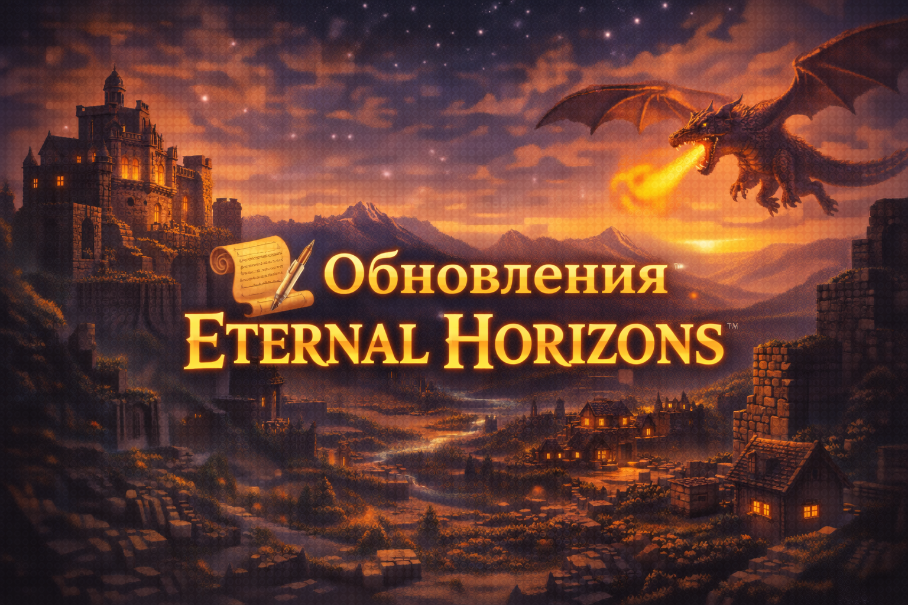

  

# 📝 История изменений  
### Eternal Horizons

Этот файл отражает развитие сборки **Eternal Horizons**  
от ранних прототипов до полноценного релиза.

---

## v1.0.0 — Перерождение  
**Статус:** Основной релиз  
**Тип:** Полноценный перезапуск сборки

### 🌍 Мир и контент
- Полностью переработана генерация мира
- Добавлены новые структуры, биомы и подземелья
- Пересобрана логика исследования и прогрессии
- Драконы и мифические существа интегрированы в геймплей

### ⚔️ Геймплей
- Внедрена новая боевая система
- Перебалансированы мобы и сложность
- Улучшено взаимодействие с лутом и артефактами
- Усилен RPG-фокус сборки

### 🎨 Визуал и атмосфера
- Обновлены шейдеры и текстурпаки
- Переработано освещение и эффекты
- Добавлены анимации и звуковые улучшения

### ⚙️ Оптимизация и стабильность
- Сборка оптимизирована под Forge 1.20.1
- Улучшена производительность без потери качества
- Исправлены критические краши и утечки памяти
- Настройки приведены к стабильному состоянию

### 🧩 Структура проекта
- Переработан список модов
- Добавлена документация (README, FAQ, GUIDE, LORE)
- Введён единый стиль оформления проекта

---

## v0.0.x — Наследие  
**Статус:** Архив  
**Тип:** Старый модпак / прототип

Эта версия отражает ранний этап развития проекта  
и служит основой для текущей сборки.

### 📦 Общие особенности
- Экспериментальная сборка без чёткого направления
- Частые изменения состава модов
- Минимальная оптимизация
- Отсутствие единого баланса

### ⚠️ Примечание
Версии **v0.0.x** больше **не поддерживаются**  
и приведены здесь исключительно как часть истории проекта.

---

⬅️ [Вернуться на главную](README.md)

