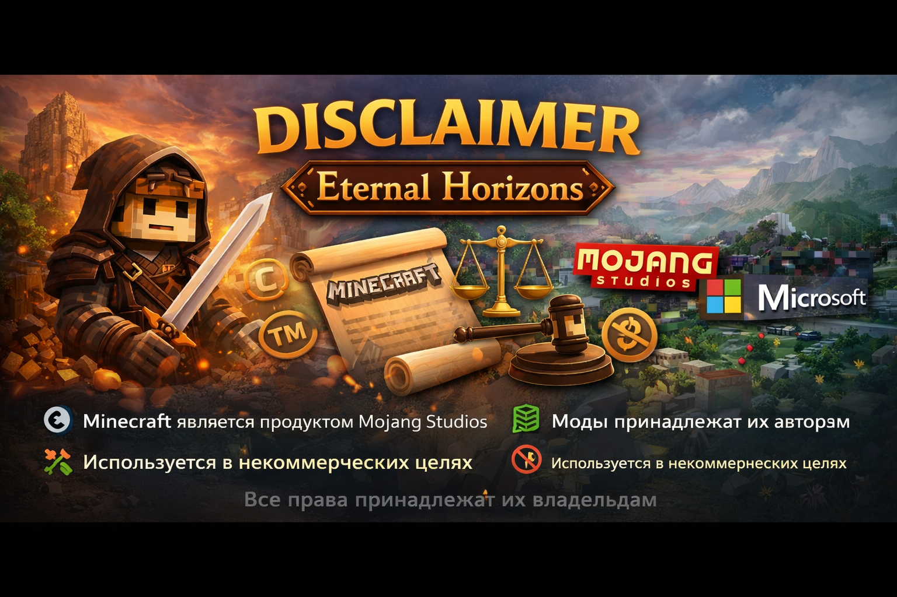

  

# ⚠️ Disclaimer  
### Eternal Horizons — Awakening of the World

---

## 📌 Общая информация

**Eternal Horizons** — это фанатская некоммерческая сборка модов для игры  
**Minecraft: Java Edition**.

Проект:
- не аффилирован с Mojang Studios или Microsoft
- не является официальным продуктом Minecraft
- создан исключительно в развлекательных целях

---

## 🧱 Права и товарные знаки

- **Minecraft** является товарным знаком **Mojang Studios**
- **Mojang Studios** и **Microsoft** не имеют отношения к данному проекту
- Все логотипы, названия и бренды принадлежат их правообладателям

---

## 🧩 Моды и сторонний контент

Все моды, используемые в сборке:

- принадлежат их авторам
- используются без изменения исходного кода
- распространяются в соответствии с их лицензиями
- применяются исключительно в некоммерческих целях

**Budovv Studio не заявляет авторских прав**  
на сторонние моды и библиотеки.

---

## ⚙️ Использование сборки

Сборка распространяется **«как есть»**, без каких-либо гарантий.

Мы не гарантируем:
- абсолютную стабильность
- отсутствие багов и вылетов
- совместимость с пользовательскими модификациями

Использование сборки осуществляется **на ваш страх и риск**.

---

## 🛠️ Изменения пользователем

Любые изменения, включая:
- добавление или удаление модов
- замену шейдеров
- замену текстурпаков
- изменение конфигураций

могут привести к:
- нестабильной работе
- повреждению сохранений
- крашам игры

Ответственность за такие изменения несёт **пользователь**.

---

## 📦 Распространение

Разрешается:
- распространять **ссылки** на официальный репозиторий
- делиться сборкой **без изменений** через официальные зеркала

Запрещается:
- перезаливать сборку от своего имени
- распространять модифицированные версии
- использовать сборку в коммерческих целях

---

## 📢 Контакты и претензии

Если вы являетесь:
- автором мода
- правообладателем контента
- представителем компании

и считаете, что ваши права нарушены —  
свяжитесь с нами для оперативного решения вопроса.

  <a href="https://t.me/budovv_studio?direct">
     
    <b>Telegram — Budovv Studio</b>
  </a>

---

⬅️ [Вернуться на главную](README.md)

