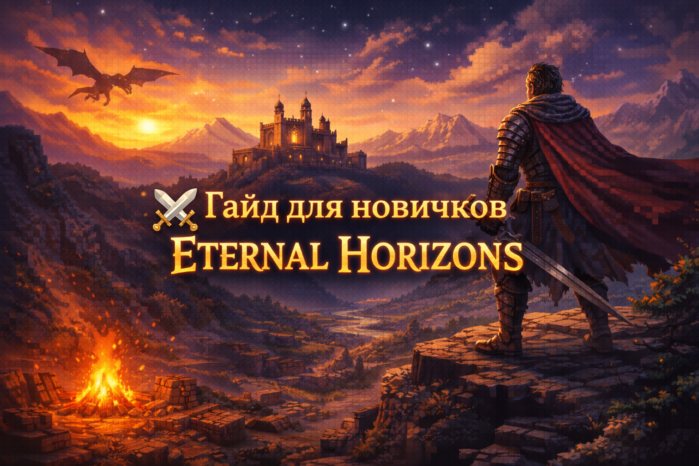

  

# ⚔️ Гайд для новичков Eternal Horizons

Добро пожаловать в **Eternal Horizons**.  
Этот мир не прощает спешки, но щедро награждает внимательных.

Этот гайд поможет тебе **выжить, освоиться и начать своё путешествие правильно**.

---

## 📌 Содержание
- 🔰 Первые минуты в мире
- 🛠️ Базовое выживание
- ⚔️ Боевая система
- 🐉 Драконы и опасности
- 🌍 Исследование мира
- 🎒 Прогресс и лут
- ⚙️ Полезные советы

---

## 🔰 Первые минуты в мире

После создания мира:

- Не убегай сразу далеко
- Осмотрись вокруг
- Обрати внимание на биом и ближайшие структуры

📘 Используй **EMI** (клавиша `R` / `U`) — это твой главный справочник.

---

## 🛠️ Базовое выживание

### Что сделать в первые 10–15 минут:

- 🌲 Собери дерево
- 🪨 Найди камень
- 🏠 Построй временное укрытие
- 🔥 Сделай факелы и костёр

❗ **Ночью мир становится значительно опаснее**, особенно в новых биомах.

---

## ⚔️ Боевая система (ВАЖНО)

В сборке используется **улучшенная боевая система**:

- Удары имеют тайминги
- Кнопку нельзя спамить
- Оружие чувствуется по-разному

### Советы:
- Не дерись с толпами
- Используй уклонение
- Следи за выносливостью и позиционированием

---

## 🐉 Драконы и крупные угрозы

❗ **Не атакуй драконов в начале игры**

- Они могут видеть тебя издалека
- У них огромный урон и радиус атаки
- Даже броня не всегда спасает

### Что делать:
- Запомнить место
- Вернуться позже
- Подготовить экипировку и зелья

---

## 🌍 Исследование мира

Мир **Eternal Horizons** создан для исследования:

- 🏛️ Руины — это не декор
- 🗺️ Структуры хранят лут и опасности
- 🌲 Биомы сильно отличаются по сложности

💡 Чем дальше ты уходишь — тем выше риск и награда.

---

## 🎒 Прогресс и лут

- Исследуй подземелья
- Собирай артефакты
- Экспериментируй с чарами
- Улучшай снаряжение постепенно

❗ Не пытайся перескочить этапы — сборка это наказывает.

---

## ⚙️ Полезные советы

- 💾 Делай резервные копии мира
- 🧠 Читай описания предметов
- ⚙️ Выдели **6–8 ГБ RAM**
- ❌ Не добавляй моды вручную
- 🎮 Игра рассчитана на **постепенное развитие**

---

## 🧭 Заключение

Ты — не избранный.  
Ты — странник в мире, который проснулся.

И только от тебя зависит,  
станешь ли ты частью истории **Eternal Horizons**  
или она поглотит тебя.

---

⬅️ [Вернуться на главную](README.md)

