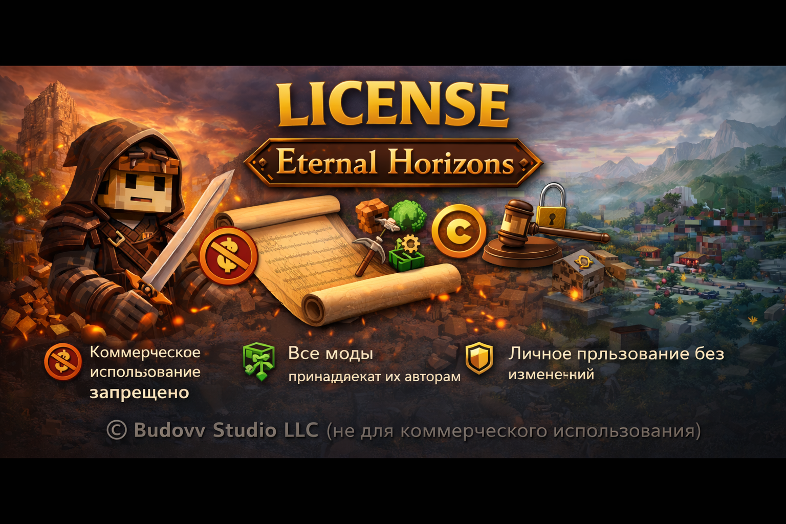

  

# 📜 License  
### Eternal Horizons — Awakening of the World

© **Budovv Studio**. Все права защищены.

---

## 🔹 Общие положения

Сборка **Eternal Horizons** является некоммерческим фанатским проектом  
и распространяется **бесплатно**, исключительно для **личного использования**.

Использование сборки означает ваше согласие с условиями данной лицензии.

---

## 💰 Коммерческое использование

❌ **Коммерческое использование ЗАПРЕЩЕНО**, включая, но не ограничиваясь:
- продажей сборки или её частей
- монетизацией доступа
- использованием в платных проектах или серверах
- включением сборки в платные сборники

---

## 🧩 Моды и сторонний контент

Все моды, библиотеки и ресурсы, входящие в состав сборки:

- принадлежат их **оригинальным авторам**
- распространяются согласно **их собственным лицензиям**
- не являются собственностью Budovv Studio

Budovv Studio **не заявляет авторских прав**  
на сторонний контент.

---

## 📦 Распространение сборки

### ✅ Разрешается:
- распространять **ссылку** на официальный репозиторий
- делиться сборкой **без изменений** через официальные зеркала
- использовать сборку в личных целях

### ❌ Запрещается:
- перезаливать сборку от своего имени
- распространять **модифицированные версии**
- удалять или подменять документацию
- выдавать сборку за собственный проект

---

## ⚙️ Изменения пользователем

Любые изменения, включая:
- добавление или удаление модов
- замену шейдеров и текстурпаков
- изменение конфигураций

осуществляются **на страх и риск пользователя**.

Budovv Studio не несёт ответственности за:
- нестабильную работу
- краши
- потерю данных или сохранений
- конфликты модов

---

## ⚖️ Ограничение ответственности

Сборка предоставляется **«как есть»**, без каких-либо гарантий,  
прямых или подразумеваемых.

Использование сборки полностью осуществляется  
**на усмотрение пользователя**.

---

## 📢 Контакты и лицензионные вопросы

Если вы являетесь:
- автором мода
- правообладателем контента
- представителем компании

и хотите:
- уточнить условия использования
- запросить удаление контента
- обсудить распространение

свяжитесь с нами:

  <a href="https://t.me/budovv_studio?direct">
     
    <b>Telegram — Budovv Studio</b>
  </a>

---

⬅️ [Вернуться на главную](README.md)

