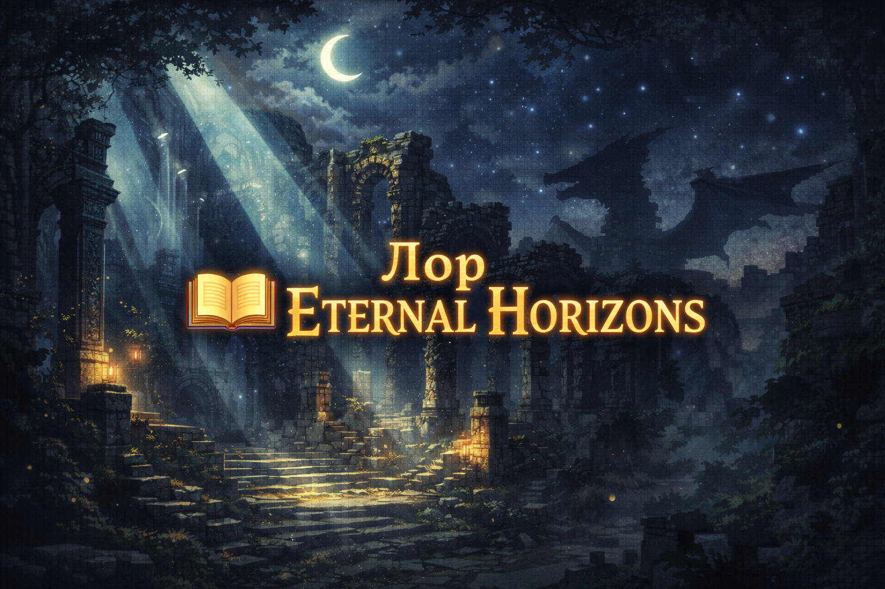

  

# 📖 Лор мира Eternal Horizons  
### Awakening of the World

Мир не всегда был таким.

Когда-то **Eternal Horizons** был цельным и гармоничным,  
миром, где магия не была силой — она была дыханием самой земли.  
Реки несли память, горы хранили волю,  
а небо отражало равновесие всего сущего.

Но равновесие — хрупкая вещь.

---

## 🌌 Эпоха Единства

В древние времена цивилизации процветали.  
Города поднимались к небесам, храмы строились в глубинах лесов,  
а люди, маги и другие народы знали своё место в мире.

Драконы в ту эпоху не были монстрами.  
Они были **Хранителями Горизонтов** —  
стражами границ между мирами, стихиями и эпохами.

---

## 🐉 Драконы — хранители, а не боги

Каждый дракон был связан с землёй, где обитал:

- Огненные — с вулканами и пустошами  
- Ледяные — с вечными снегами  
- Грозовые — с небесами и штормами  

Их задача была проста:  
**следить, чтобы мир не переходил точку невозврата**.

Но даже хранители устают.

---

## 💥 Падение и Забвение

С течением времени смертные захотели большего.  
Они стремились подчинить магию,  
использовать силу драконов,  
изменить саму структуру мира.

Когда был нарушен древний договор,  
мир дрогнул.

Города рухнули,  
магия исказилась,  
драконы исчезли,  
а история превратилась в легенды.

Наступила Эпоха Забвения.

---

## 🌑 Эпоха Тишины

Мир выжил, но стал иным.

Руины заросли лесами,  
пески скрыли города,  
а знания рассыпались на обрывки мифов.

Люди забыли,  
но мир — нет.

---

## 🌅 Пробуждение Мира

Теперь древние механизмы вновь начинают работать.  
Земля дрожит,  
структуры появляются из ниоткуда,  
а в небе снова слышен рёв крыльев.

Это называют **Пробуждением**.

Мир не зовёт.  
Мир **требует ответа**.

---

## ⚔️ Роль Странника

Ты не герой из пророчества.  
Ты не избранный.

Ты — **Странник**,  
оказавшийся в момент, когда прошлое возвращается.

Каждый твой шаг,  
каждое открытие,  
каждая победа или поражение  
вплетаются в новую историю мира.

---

## 🌍 Горизонты будущего

Драконы возвращаются.  
Магия становится нестабильной.  
Границы между эпохами стираются.

Мир не ждёт спасителя.  
Он ждёт **решения**.

---

## 🜂 Последние строки

**Eternal Horizons** — это не история о победе.  
Это история о выборе.

И когда ты сделаешь первый шаг,  
мир посмотрит на тебя  
и решит —  
достоин ли ты узнать правду.

---

⬅️ [Вернуться на главную](README.md)
