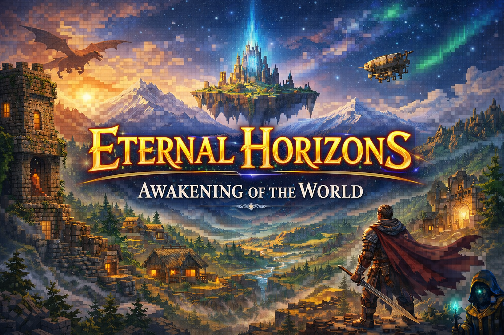
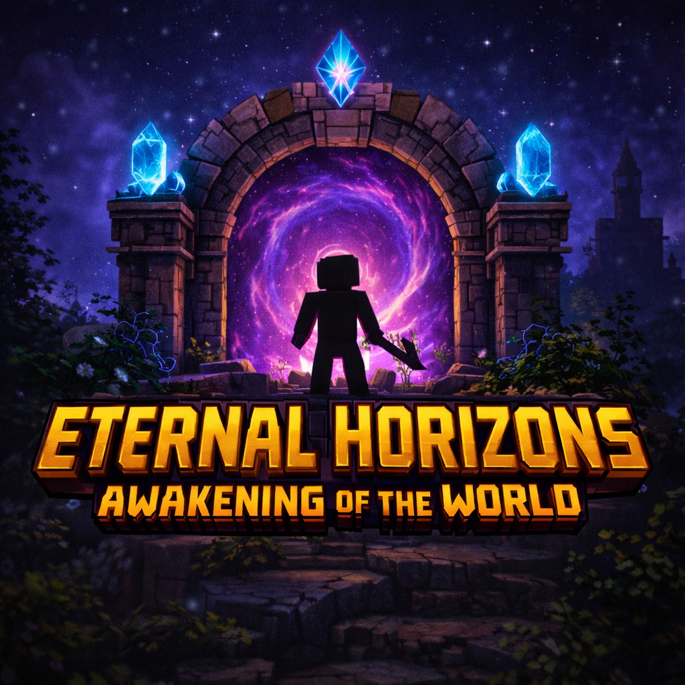
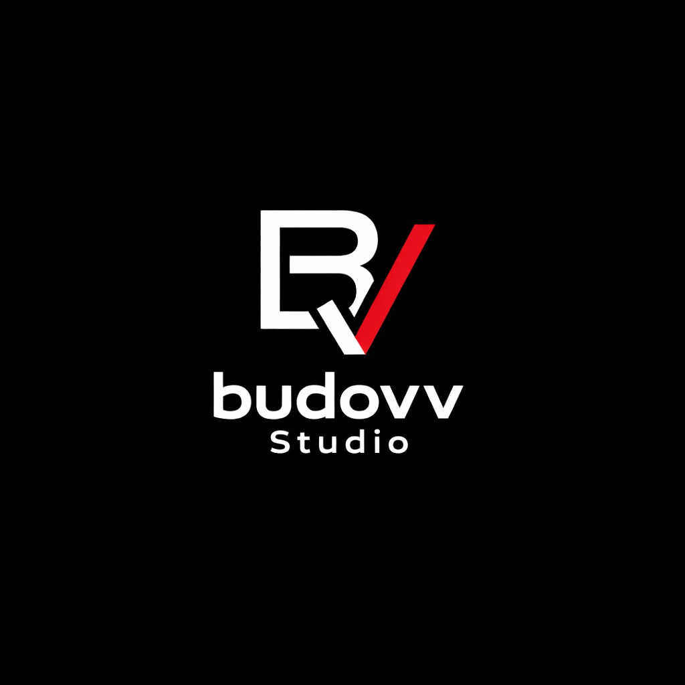

  

  

# 🌌 Eternal Horizons  
### Awakening of the World

**Eternal Horizons** — это масштабная RPG-сборка для **Minecraft 1.20.1 (Forge)**,  
ориентированная на **исследование**, **прогрессию**, **опасный живой мир** и **глубокую атмосферу**.

Это не ваниль.  
Это мир, который требует подготовки, внимания и времени.

---

## 📌 Навигация

- 📦 [Установка](INSTALL.md)
- ⚔️ [Гайд для новичков](GUIDE.md)
- 📖 [Лор мира](LORE.md)
- 🧩 [Список модов](MODS.md)
- ❓ [FAQ](FAQ.md)
- 🛠️ [Устранение неполадок](TROUBLESHOOTING.md)
- 🐞 [Сообщить о баге](BUG_REPORT.md)
- 📝 [История изменений](CHANGELOG.md)
- ⚖️ [Лицензия](LICENSE.md)
- ⚠️ [Дисклеймер](DISCLAIMER.md)

---

## ✨ Особенности сборки

- 🐉 **Опасные существа и драконы**  
  Сильные враги, рассчитанные на позднюю игру.

- ⚔️ **Продуманная боевая система**  
  Улучшенный бой, оружие, магия и артефакты.

- 🌍 **Живой мир**  
  Новая генерация, структуры, подземелья и события.

- 📜 **RPG-прогрессия**  
  Мир и игрок развиваются постепенно.

- 🎨 **Атмосфера и визуал**  
  Шейдеры, текстурпаки, анимации и звуки уже настроены.

- ⚙️ **Оптимизация и стабильность**  
  Сборка протестирована и оптимизирована.

---

## 📦 Скачать сборку

⚠️ **Сборка не хранится напрямую на GitHub.**  
Используйте официальные зеркала загрузки:

- [Mega](https://mega.nz/file/0vJWlBBD#fausnYa6c_DHxGGSDr_SeoIzWOgQsuzmMESiefF7jGw)
- [Google Disk](https://drive.google.com/file/d/1F45vGMEwH7CIaWOlnWLA_oIOlvzb12LJ/view?usp=drive_link)
- [Yandex Disk](https://disk.yandex.ru/d/VNfh9ZTrpiCm7w)

📘 Подробная инструкция по установке:  
➡️ [Установка](INSTALL.md)

---

## ⚠️ Важная информация

> В сборке уже **предустановлены и оптимизированы**:
> - шейдеры  
> - текстурпаки  
> - графические и игровые настройки  
>
> Разрешается:
> - переключать шейдеры из уже установленных
> - полностью отключать шейдеры
>
> ❗ Добавление своих модов, шейдеров, текстурпаков  
> или изменение настроек выполняется **на ваш страх и риск**.

---

## 🧭 С чего начать новичку

1. 📦 Установите сборку → [Установка](INSTALL.md)
2. ⚔️ Изучите основы → [Гайд](GUIDE.md)
3. 📖 Погрузитесь в мир → [Лор](LORE.md)
4. ❓ Есть вопросы → [FAQ](FAQ.md)
5. 🛠️ Проблемы → [Устранение проблем](TROUBLESHOOTING.md)

---

## 🐞 Нашли баг?

Если вы столкнулись с ошибкой или вылетом:

➡️ Ознакомьтесь с  
[🛠️ Устранение проблем](TROUBLESHOOTING.md)

➡️ Если проблема не решена — заполните форму:  
[🐞 BUG_REPORT](BUG_REPORT.md)

---

## 💬 Сообщество и поддержка

  <a href="https://t.me/budovv_studio?direct">
     
    <b>Telegram-сообщество Budovv Studio</b>
  </a>

В Telegram вы можете:
- задать вопрос по сборке
- получить помощь
- сообщить о баге
- следить за обновлениями
- общаться с сообществом

---

## 📝 Версия сборки

- **Eternal Horizons:** v1.0.0  
- **Minecraft:** 1.20.1  
- **Loader:** Forge  

История изменений:  
➡️ [CHANGELOG](CHANGELOG.md)

---

## ⚖️ Юридическая информация

- 📜 [Лицензия](LICENSE.md)
- ⚠️ [Дисклеймер](DISCLAIMER.md)

---

© **Budovv Studio**  
**Eternal Horizons — Awakening of the World**
