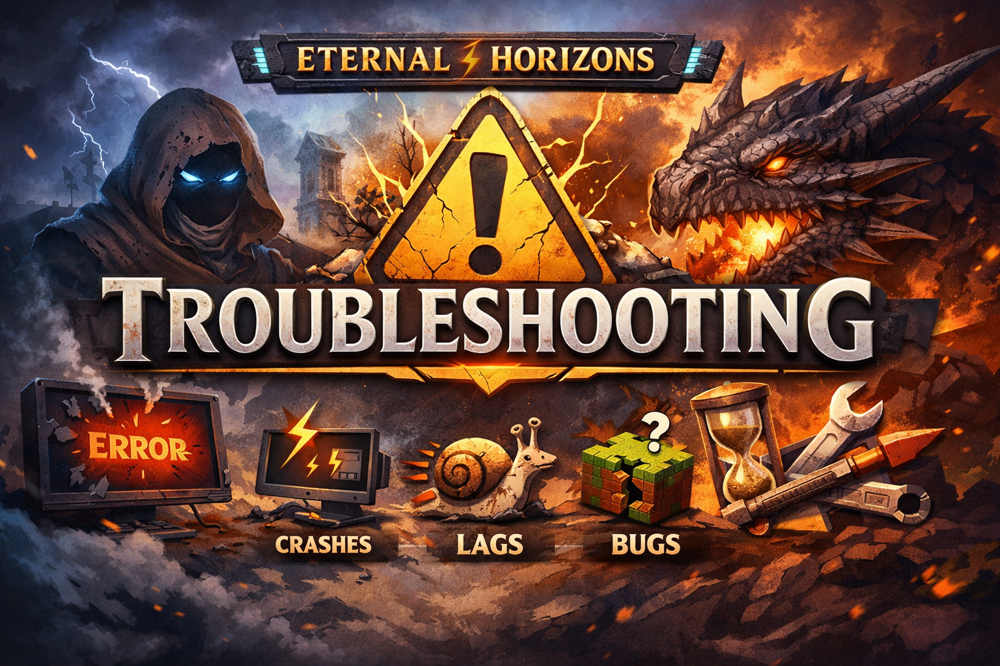

  

# 🛠️ Устранение неполадок  
### Eternal Horizons

Этот документ предназначен для решения **наиболее распространённых проблем**,  
которые могут возникнуть при установке, запуске или игре в сборку  
**Eternal Horizons**.

⚠️ **Перед обращением за помощью настоятельно рекомендуется ознакомиться с этим разделом.**

---

## 🚨 Игра не запускается / вылетает при старте

### Проверьте в первую очередь:

- Используется **Java 17**
- Выделено **не менее 6 ГБ RAM** (рекомендуется 8 ГБ)
- Сборка импортирована **через ElyPrismLauncher**
- Архив сборки **не распаковывался вручную**
- Используется **чистый инстанс**, без сторонних модов

---

### Ошибка `Exit Code: 1 / -1 / -805306369`

Возможные причины:
- недостаточно оперативной памяти
- неправильная версия Java
- повреждённый инстанс

**Решение:**
1. Проверь RAM (Настройки → Java)
2. Убедись, что выбрана Java 17
3. Пересоздай инстанс, импортировав сборку заново

---

## ⏳ Первый запуск занимает очень много времени

Это **нормально**.

При первом запуске:
- генерируются кэши
- инициализируются моды
- подготавливаются шейдеры
- компилируются ресурсы

⏱️ Первый запуск может длиться **5–10 минут**.

⚠️ **Не закрывайте игру**, даже если кажется, что она зависла.

---

## ⚙️ Низкий FPS / лаги

### Что можно сделать:

- Уменьшить дальность прорисовки
- **Отключить шейдеры**
- Закрыть фоновые программы
- Убедиться, что используется дискретная видеокарта

---

### ⚠️ ВАЖНО О НАСТРОЙКАХ

В сборке:
- шейдеры **уже установлены**
- текстурпаки **уже настроены**
- параметры **оптимизированы**

Разрешается:
- ✅ переключать шейдеры из уже установленных
- ✅ полностью отключать шейдеры

❌ Добавление сторонних шейдеров и текстурпаков:
- на **ваш страх и риск**
- может вызвать лаги, баги или краши

---

## 🧩 Краши во время игры

### Частые причины:

- изменение настроек сборки
- добавление / удаление модов
- сторонние шейдеры
- повреждённый мир

**Что делать:**
1. Верните стандартные настройки
2. Отключите шейдеры
3. Попробуйте загрузить **новый мир**
4. Проверьте `latest.log` / `crash-report`

---

## 🌍 Проблемы с миром / генерацией

### Мир выглядит странно или сломан

Возможные причины:
- мир создан на старой версии сборки
- конфликт модов
- повреждение сохранения

⚠️ Обновление сборки **может требовать нового мира**.

**Рекомендация:**  
Перед обновлением всегда делайте **резервную копию мира**.

---

## 🧠 Проблемы с модами

### Можно ли добавлять свои моды?
❌ **Не рекомендуется.**

Добавление модов может:
- сломать баланс
- вызвать краши
- повредить сохранения

---

### Можно ли удалять моды?
❌ Также не рекомендуется без понимания зависимостей.

---

## 🖥️ Проблемы с лаунчером

### Игра не появляется в списке
- Проверь, что импорт был завершён
- Перезапусти ElyPrismLauncher

### Лаунчер зависает
- Обнови ElyPrismLauncher
- Проверь интернет-соединение

---

## 🧪 Как правильно сообщить о проблеме

Перед тем как писать в поддержку, подготовь:
- версию сборки
- версию Minecraft (1.20.1)
- лог `latest.log`
- crash-report (если есть)
- описание действий перед ошибкой

---

## 💬 Нужна помощь?

Если проблема **не решилась** после выполнения всех шагов выше —  
мы всегда готовы помочь.

  <a href="https://t.me/budovv_studio?direct">
     
    <b>Telegram-сообщество Budovv Studio</b>
  </a>

В Telegram вы можете:
- задать вопрос по сборке
- получить помощь с установкой
- сообщить о баге
- следить за обновлениями
- общаться с сообществом

---

⬅️ [Вернуться на главную](README.md)
